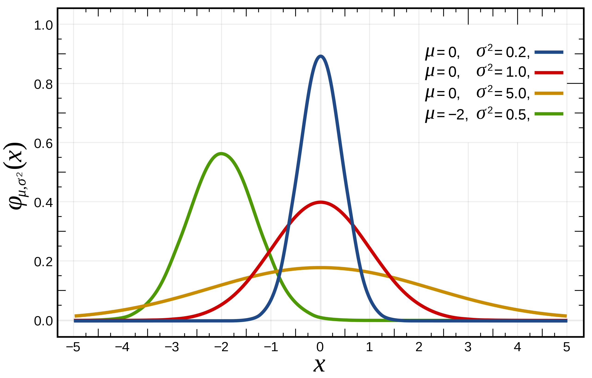
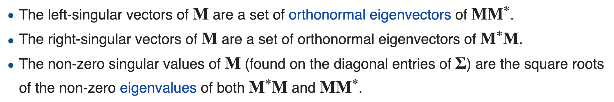
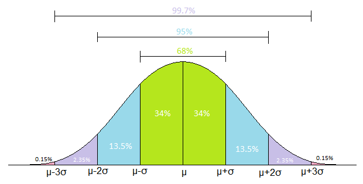
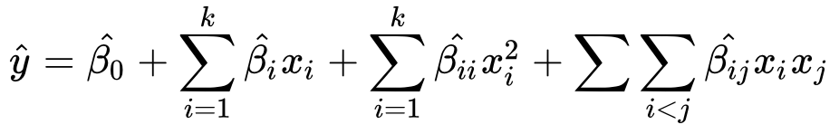

# TODO

### Understand Logistic Regression lost and cost function better

# Good documentations

## Machine Learning

台湾大学林轩田机器学习笔记: https://wizardforcel.gitbooks.io/ntu-hsuantienlin-ml/content/

字典 https://ml-cheatsheet.readthedocs.io/en/latest/

## Deep Learning

Andrew Ng 系列课程 https://www.coursera.org/learn/neural-networks-deep-learning

怎样学习Deep learning <https://www.zhihu.com/question/26006703/answer/536169538>

# Types of Machine Learning Algorithms

<https://towardsdatascience.com/types-of-machine-learning-algorithms-you-should-know-953a08248861>

{width="9.675213254593176in"
height="4.219241032370953in"}

# Regression

## Assumptions

1.  Regression analysis is sensitive to outliers
2.  The main assumptions of regression are normality, [homoscedasticity](#homoscedasticity-heteroscedasticity), and absence of multicollinearity.

| Regression             | Assumptions                                                  |
| ---------------------- | ------------------------------------------------------------ |
| Linear                 | http://www.statisticssolutions.com/assumptions-of-linear-regression/  • Linear relationship between independent and dependent variables • All variables obey Multivariate Gaussian Distribution This is why it is sensitive to outliers. When the data is not normally distributed a non-linear transformation (e.g., log-transformation) might fix this issue. • there is little or no multicollinearity (correlation between features) • there is little or no autocorrelation (correlation with previous data on a feature) •	? |
| Logistic               | ?                                                            |
| Naive Bayes classifier | independence between every pair of features                  |

<http://www.statisticssolutions.com/directory-of-statistical-analyses-regression-analysis/regression/>

regression = prediction

| Name              | H(x)            | Output  | Type |
| ----------------- | --------------- | ------- | ---- |
| Linear Regression | $$\theta^{T}X$$ | Numbers | Regression |
|[Polynomial](#polynomials) (linear) Regression|$$\theta_0+\theta_1 x+\theta_2 x^2+⋯+\theta_n x^n$$|Numbers|Regression|
|Logistic Regression|$$g(\theta^T X)$$|Numbers in (0, 1)  Odds / probability|Regression|
|Probit||||
|OLS||||
|Locally Weighted Linear (LWLR)||||
|Perceptron Learning Algorithm (PLA)||Classification||

## Risk functional

it's the **expected loss** of f , where the expectation is over (x,y) ∼ PX×Y.

It evaluates the performance of a model in all predictions

<https://stats.stackexchange.com/questions/104988/what-is-the-difference-between-a-loss-function-and-decision-function>

## Derivative

Where the slope is zero

How Do We Know it is a Maximum (or Minimum)? - **Second Derivative Test: derivative of the slope**

When a function\'s slope is zero at x, and the second derivative at x is:

-   less than 0, it is a local maximum -- like the plot above

-   greater than 0, it is a local minimum

-   equal to 0, then the test fails (there may be other ways of finding
    out though)

<https://www.shuxuele.com/calculus/maxima-minima.html>

## Gradient vector

{width="5.21330927384077in"
height="2.945744750656168in"}

<https://www.youtube.com/watch?v=tIpKfDc295M&feature=youtu.be>

## Gradient Descent

https://www.jianshu.com/p/c7e642877b0e

https://jums.club/pdf/Gradient_Descent.pdf

## Sign function

## Logit function

the inverse of the [sigmoidal \"logistic\" function](#Logistic / Inverse Logit Function)

$$g^{- 1}(x) = logit(x) = \log\left( \frac{x}{1 - x} \right) = \log(x) - \log(1 - x) = - log(\frac{1}{x} - 1)$$

## Logistic Regression

{width="4.557377515310586in"
height="3.7131211723534556in"}

Hypothesis function ${g(\theta}^{T}X)$ is the probability that $y=1$. 

Then $y=1$ if ${g(\theta}^{T}X) = a$ or $\theta^{T}X = z\ $ ($a$ could be $0.5$ and $z$ is $0$) which is the decision boundary.

Decision boundary is used to flag (0 or 1) y, which is different from Hypothesis function.

## Linear Regression

$\theta^{T}X$ can be 

* linear $\theta_{0} + \theta_{1}x_{1} + \theta_{2}x_{2}$ or 
* non-linear $\theta_{0} + \theta_{1}x_{1} + \theta_{2}x_{2}^{2}$ polynomial regression, or 
* any other shape (e.g. circle).

#### Interpret $\theta^{T}X = \theta_{0} + \theta_{1}x_{1} + \theta_{2}x_{2} + e$ 

$\theta_{0}$ , the Y-intercept

$\theta_{1},\ \theta_{2}$ , regression coefficients

If $x_{1}$ is a continuous variable, one-unit is 1. $\theta_{1}$
represents the difference in the predicted value of Y for each one-unit
difference in $x_{1}$, if $x_{2}$ remains constant. See [Beta
coefficient](#beta-coefficient)

This means that if $x_{1}$ differed by one-unit (and $x_{2}$ did not
differ) $Y$ will differ by $\theta_{1}$ units, on average.

If $x_{1}$ is categorical variable, one-unit is switching from one
category to the other. $\theta_{1}$ is then the average difference in
$Y$ between the category for which $x_{1} = 0$ (the reference group) and
the category for which $x_{1} = 1$ (the comparison group).

Each coefficient represents the additional effect of **adding** that
variable to the model, that's why multicollinearity should be avoid.

<https://www.theanalysisfactor.com/interpreting-regression-coefficients/>

## Lasso Regression?

Using L1 norm on linear regression

## Ridge Regression?

Using L2 norm on linear regression

<https://blog.csdn.net/jinping_shi/article/details/52433975>

##  Gaussian processes -- Kriging

[Multivariable normal distribution](#multivariate-gaussian-distribution)

$$y = \begin{bmatrix}
y_{1} \\
y_{2} \\
\end{bmatrix},\ y\mathcal{\sim N}\left( \begin{bmatrix}
\mu_{1} \\
\mu_{2} \\
\end{bmatrix},\begin{bmatrix}
\Sigma_{11} & \Sigma_{12} \\
\Sigma_{21} & \Sigma_{22} \\
\end{bmatrix} \right)$$

The marginal distributions of $y_{1}$ and $y_{2}$ are also normal with
mean vector $\mu_{i}$ and covariance matrix $\Sigma_{ii}$, respectively.

$$y_{i}\mathcal{\sim N}\left( \mu_{i},\ \Sigma_{ii} \right)$$

{width="5.615999562554681in"
height="3.2949168853893265in"}

### Cholesky decomposition

<https://www.qiujiawei.com/linear-algebra-11/>

# All functions relationship

For Logistic Regression or a unit of neural network

Having **decision functions** for an output $\hat{y}$
$$
\hat y = \sigma(w^Tx + b)
$$
Using **activation functions** $\sigma (z)$ in decision function to map $z$ to expected range. For example, Sigmoid Function / Logistic Function in the range $(0, 1)$
$$
\sigma (z) = \frac {1}{1 + e^{-z}}
$$
Rely on **Loss function** $L(y, \hat{y})$ to decide the distance between decision function output $\hat{y}$ with the ground truth $y$. Here it is Cross-entropy
$$
\displaystyle L(y, \hat{y})=−[𝑦log(\hat{y})+(1−𝑦)log(1−\hat{y})]
$$
$$log$$ always means the natural log in machine learning world.

Want to function $w$,  $b$ that minimize **cost function** $J(w, b)$
$$
\displaystyle J(w, b)=−\frac{1}{m}\sum_{i=1}^{m}L(y^{(i)}, \hat{y}^{(i)})=−\frac{1}{m}\sum_{i=1}^{m}[𝑦^{(i)}log(\hat{y}^{(i)})+(1−𝑦^{(i)})log(1−\hat{y}^{(i)})]
$$
Then **Gradient Descent** helps to find the global optimal/minimal of the cost function

$$
Repeat\ for\ each\ training\ data\ [x^{(i)}, y^{(i)}]:\\
w:=w-\alpha\frac{dJ(w,b)}{dw}\\
b:=b-\alpha\frac{dJ(w,b)}{db}\\
Until\ converge
$$

# Decision functions

A **decision function** is a function which takes a dataset as input and gives a decision as output. What the decision can be depends on the problem at hand. Examples include:

- *Estimation problems:* the "decision" is the estimate.
- *Hypothesis testing problems:* the decision is to reject or not reject the null hypothesis.
- *Classification problems:* the decision is to classify a new observation (or observations) into a category.
- *Model selection problems:* the decision is to chose one of the candidate models.

# Loss functions

Loss function describes the loss (or cost) associated with all possible decisions.

It evaluates the performance of a model in a prediction.

Loss function is:
$$
\displaystyle L(y, \hat{y})
$$

## Loss function vs Decision function

Loss functions are used to determine which decision function to use. The best decision function is the function that yields the lowest **expected loss**.

<https://stats.stackexchange.com/questions/104988/what-is-the-difference-between-a-loss-function-and-decision-function>

## List of Loss functions

https://ml-cheatsheet.readthedocs.io/en/latest/loss_functions.html

https://towardsdatascience.com/what-is-loss-function-1e2605aeb904

https://www.numpyninja.com/post/loss-functions-when-to-use-which-one

### **Classification**

#### Cross-entropy [link](https://ml-cheatsheet.readthedocs.io/en/latest/loss_functions.html#cross-entropy) or Log loss 

Understand Cross-entropy https://zhuanlan.zhihu.com/p/38241764
$$
\displaystyle L(y, \hat{y})=−[𝑦log(\hat{y})+(1−𝑦)log(1−\hat{y})]
$$

​		Cost function
$$
\displaystyle J(w, b)=−\frac{1}{m}\sum_{i=1}^{m}[𝑦^{(i)}log(\hat{y}^{(i)})+(1−𝑦^{(i)})log(1−\hat{y}^{(i)})]
$$
The cost function of Log loss win because the cost function is convex that has a global optimal, compare to mean square error that is non convex and has a lot of local optimal

#### 

#### Exponential Loss [link](https://towardsdatascience.com/what-is-loss-function-1e2605aeb904)

#### Hinge Loss [link](https://ml-cheatsheet.readthedocs.io/en/latest/loss_functions.html#hinge)

#### Kullback Leibler Divergence Loss [link](https://ml-cheatsheet.readthedocs.io/en/latest/loss_functions.html#kullback-leibler)

### **Regression**

#### Mean Square Error  (MSE- L2) also called L2 regularization [link](https://ml-cheatsheet.readthedocs.io/en/latest/loss_functions.html#mse-l2)

#### Mean Absolute Error (MAE- L1) also called L1 regularization [link](https://ml-cheatsheet.readthedocs.io/en/latest/loss_functions.html#mae-l1)

#### Huber Loss [link](https://ml-cheatsheet.readthedocs.io/en/latest/loss_functions.html#huber): a combination of MAE and MSE (L1-L2)

#### RMSE [link](https://ml-cheatsheet.readthedocs.io/en/latest/loss_functions.html#rmse-1)

# Cost Functions

the cost function is the average of the loss functions of the entire training set.
$$
J(w, b)=\frac{1}{m}\sum_{i=1}^{m}L(\hat y^{(i)}, y^{(i)})
$$
The cost function of Log loss win because the cost function is convex that has a global optimal, compare to mean square error that is non convex and has a lot of local optimal.

# Activation Functions

Activation Functions are **decision making units of neural networks**. They calculate net output of a neural node. An Activation Function decides whether a neuron should be **activated (1) or not (0)**. This means that it will decide whether the neuron’s input to the network is important or not in the process of prediction using simpler mathematical operations. 

The role of the Activation Function is to derive output from a set of input values fed to a node (or a layer).

## Sigmoid functions

\"S\"-shaped curve or sigmoid curve.

Sigmoid functions have domain of all real numbers, with return value monotonically increasing most often from 0 to 1 or alternatively from −1 to 1, depending on convention.

### Logistic Function / Inverse-Logit Function

Given a numeric object return the inverse logit of the values in range
(0, 1)
$$
g(z) = logistic(z) = \frac{1}{1 + e^{- z}} = \frac{e^{z}}{e^{z} + 1}
$$

### Other Sigmoid functions

<https://en.wikipedia.org/wiki/Sigmoid_function>

{width="7.1in"
height="3.547222222222222in"}

## Rectified Linear Unit (ReLU)

$$f(x)=x^{+}=\max(0,x)$$

## Sigmoid vs ReLU

## Softmax

Map input to (0, 1) as probability 

# Clustering

## K-means

<https://blog.csdn.net/huangfei711/article/details/78480078>

# Kernel

<https://www.cs.toronto.edu/~duvenaud/cookbook/>

## RBF (Radial Based Function)

{width="2.6098436132983376in"
height="0.760148731408574in"}

<https://blog.csdn.net/yzf0011/article/details/71521001>

## Squared Exponential kernel - Gaussian kernels

# Norm

<https://rorasa.wordpress.com/2012/05/13/l0-norm-l1-norm-l2-norm-l-infinity-norm/>

<https://blog.csdn.net/zouxy09/article/details/24971995/>

## L0

The count of non-zeros in vector -\> sparse

$$\left\| x \right\|_{0} = \#(i|x_{i} \neq 0)$$

## L1 - Lasso regularization

Sum of absolute value of vector

$$\left\| x \right\|_{1} = \sum_{i}^{}\left| x_{i} \right|$$

{width="2.6in"
height="2.6in"}

## L2 - Ridge Regression

$$\left\| x \right\|_{2} = \sqrt{\sum_{i}^{}{x_{i}}^{2}}$$

{width="2.6in"
height="2.6in"}

## Why is L1 regularization supposed to lead to sparsity than L2

L1 has sparsity: running Lasso linear regression, can get sparse
coefficient

{width="4.980995188101487in"
height="2.4904975940507437in"}

# Outliers

## Interquartile range (IQR)

{width="4.677257217847769in"
height="5.1in"}

## BoxPlot

{width="2.0473075240594927in"
height="3.5in"}

# Feature Selection

<https://www.jianshu.com/p/45968f4d5f86>

<https://blog.csdn.net/key_v/article/details/48008725>

# Feature Detection

## Speeded Up Robust Features (SURF)

# Gaussian function

## 1D - bell curve

$$f(x) = ae^{- \frac{(x - \mu)^{2}}{2\sigma^{2}}}$$

When $a = \frac{1}{\sigma\sqrt{2\pi}}$

$$g(x) = \frac{1}{\sigma\sqrt{2\pi}}e^{- \frac{(x - \mu)^{2}}{2\sigma^{2}}}$$

{width="5.046153762029746in"
height="3.224786745406824in"}

## 2D

$$f(x,y) = A\ \exp\left( - \left( \frac{\left( x - \mu_{x} \right)^{2}}{2\sigma_{x}^{2}} \right)^{P_{x}} - \left( \frac{\left( y - \mu_{y} \right)^{2}}{2\sigma_{y}^{2}} \right)^{P_{y}} \right)$$

{width="4.4in"
height="3.299620516185477in"}

<https://blog.csdn.net/jorg_zhao/article/details/52687448>

# PCA

## Signal noise ratio

Signal has larger power/variance than noise

{width="5.929725503062118in"
height="2.2in"}

# Sparse representation

<https://www.zhihu.com/question/24124122/answer/50403932>

<https://www.zhihu.com/question/26602796/answer/33431062>

## Dictionary Learning 

$$\min_{B,\alpha_{i}}{\sum_{i = 1}^{m}\left\| x_{i} - B\alpha_{i} \right\| + \lambda\sum_{i = 1}^{m}\left\| \alpha_{i} \right\|_{1}}$$

$$x_{i}:Sample\ i$$

$$\alpha_{i}:Sparse\ format\ of\ sample\ i$$

$$B:dictionary\ matrix$$

$$\lambda:parameter$$

$$\min_{B,\alpha_{i}}{\sum_{i = 1}^{m}\left\| x_{i} - B\alpha_{i} \right\|}:\ B\alpha_{i}\ should\ be\ as\ samilar\ as\ x_{i}$$

$$\min_{B,\alpha_{i}}{\sum_{i = 1}^{m}\left\| \alpha_{i} \right\|}:\ \alpha_{i}\ should\ be\ as\ sparse\ as\ possible$$

<https://blog.csdn.net/m0_37407756/article/details/68059453>

<https://zhuanlan.zhihu.com/p/26015351>

# Naive Bayes

## What's so naive about naive Bayes?

Naive Bayes is called naive because it assumes that each input variable is independent. This is a strong assumption and unrealistic for real data; however, the technique is very effective on a large range of complex problems.

$$P(Y|X) = P(Y) * P(X|Y) / P(X)$$

# Ensemble Techniques

1. Random Forest : Bagging + Decision tree
2. Boosting Tree : AdaBoost + Decision tree
3. GBDT : Gradient Boost + Decision tree

https://www.datalearner.com/blog/1051538295125157

## Bagging

bootstrap aggregating

## Boosting

# Decision Tree

{width="6.1064348206474195in"
height="4.572421259842519in"}

<https://blog.csdn.net/xbinworld/article/details/44660339>

# Random Forest -- classification and regression

A kind of Ensemble Learning

Bagging + Decision Tree

{width="6.091535433070866in"
height="4.576052055993001in"}

<http://backnode.github.io/pages/2015/04/23/random-forest.html>

# Polynomials

A polynomial turns a linear regression model into a curve. Although
polynomial regression fits a nonlinear model to the data, as a
statistical estimation problem it **is linear**, because it is X that is
squared, cubed or higher degrees, not the [Beta
coefficient](#beta-coefficient)

A polynomial in the variable 𝑥 is a representation of a function

$$A(x) = a_{0} + a_{1}x + a_{2}x^{2} + \cdots + a_{n - 1}x^{n - 1} = \sum_{j = 0}^{n - 1}{a_{j}x^{j}}$$

We call the values
$\mathbf{a}_{\mathbf{0}},\ \mathbf{a}_{\mathbf{1}},\ \cdots,\ \mathbf{a}_{\mathbf{n} - \mathbf{1}}$
the coefficients of the polynomial

$A(x)\ $is said to have **degree n** if its highest nonzero coefficient
is $\mathbf{a}_{\mathbf{n}}$.

Any integer strictly greater than the degree (n) of a polynomial is a
**degree-bound** of that polynomial

## Coefficient representation

of a polynomial $A(x) = \sum_{j = 0}^{n - 1}{a_{j}x^{j}}$ of
degree-bound **𝑛** is a **vector of coefficients**

$$a = (a_{0},\ a_{1},\ \cdots,\ a_{n - 1})$$

{width="3.722494531933508in"
height="0.7112718722659668in"}

## Point-Value Representation

A point-value representation of a polynomial $A(x)$ of degree-bound 𝑛 is
a set of 𝑛 point-value pairs

$$\{\left( x_{0},\ y_{0} \right),\ \left( x_{1},\ y_{1} \right),\ \cdots,\ \left( x_{n - 1},\ y_{n - 1} \right)\}$$

such that all of the $x_{k}$ are **distinct** and $y_{k} = A(x_{k})$ for
$k = 0,1,\ldots,n - 1$

{width="3.7822440944881888in"
height="0.692308617672791in"}

## Evaluation

Calculate $A\left( x_{0} \right)$ - Horner's rule, $\Theta(n)$ time
complexity

$$A(x_{0}) = a_{0} + x_{0}(a_{1} + x_{0}\left( a_{2} + \cdots + {x_{0}a}_{n - 1} \right))$$

## Multiplication

If $A(x)$ and $B(x)$ are polynomials of degree-bound n, we say their
**product** $C(x)$ is a polynomial of degree-bound 2𝑛−1.

$$C(x) = \sum_{j = 0}^{2n - 1}{c_{j}x^{j}},\ here\ c_{j} = \sum_{k = 0}^{j}{a_{k}b_{j - k}}$$

**Multiplication** of two degree-bound n polynomials $A(x)$ and $B(x)$
takes time $\Theta\left( n^{2} \right)$, since each coefficient in
vector $a$ must be multiplied by each coefficient in vector $b$.

{width="4.259185258092739in"
height="1.7393164916885389in"}

The resulting coefficient vector
$c = (c_{0},\ c_{1},\ \cdots,\ c_{2n - 1})$ is also called the
**[convolution](#_Convolution)** of the input vectors $a$ and $b$,
denoted as

$$c = \left( c_{0},\ c_{1},\ \cdots,\ c_{2n - 1} \right) = (\sum_{k = 0}^{0}{a_{k}b_{0 - k}},\ \sum_{k = 0}^{1}{a_{k}b_{1 - k}},\ \cdots,\sum_{k = 0}^{2n - 1}{a_{k}b_{2n - k}}) = a\bigotimes b$$

$$a = \left( a_{0},\ a_{1},\ \cdots,\ a_{n - 1} \right)\ and\ b = (b_{0},\ b_{1},\ \cdots,\ b_{n - 1})$$

Not finished ... [Must
read](file:///Users/chenxishi/Google%20Drive/Learn/Polynomials_and_FFT.pdf)

## Least Squares Fitting---Polynomial

# Beta coefficient

The beta coefficient is the degree of change in the outcome variable for
every 1-unit of change in the predictor variable.

<http://www.statisticssolutions.com/directory-of-statistical-analyses-regression-analysis/regression/>

# Convolution

## Definition

### Real coordinate space:

Convolution: Continuous
$(x*y)(\tau) = \int_{- \infty}^{\infty}{x(t)y(}\tau - t)dt$

Discrete
$(f*g)\lbrack n\rbrack = \sum_{i = - \infty}^{\infty}{f\lbrack n - i\rbrack g\lbrack i\rbrack}$\
Understand the formula:

n / $\tau$: Calculate the output/convolution on the $n^{th}$ / $\tau$
moment (current)

i / t: All of available moment before current and current moment (
$n^{th}$ / $\tau$ )

$(f*g)\lbrack n\rbrack$: at current moment n, calculate all remaining
effects of previous moments \[1\~n\], and the full effect of current
moment n

Example:
{width="4.1091590113735785in"
height="1.9633453630796152in"}

## 2D？

## Convolution and Autocorrelation

Autocorrelation:
$R(\tau) = \int_{- \infty}^{\infty}{x(t)x(t - \tau)}dt = x(t)*x( - t)$
this is convolution

In complex space:

Autocorrelation:
$R(\tau) = \int_{- \infty}^{\infty}{x(t)\overline{x(t - \tau)}}dt$
imaginary part = 0, because argument = $0^{o}$

## Convolution and Correlation?

{width="3.670967847769029in"
height="2.7546620734908136in"}

## Convolution theorem

Convolution in the time domain is equivalent to multiplication in the
frequency domain and vice versa.

$$\mathcal{F}\lbrack f*g\rbrack\mathcal{= F}\lbrack f\rbrack\mathcal{F}\lbrack g\rbrack$$

$$\mathcal{F}\lbrack fg\rbrack\mathcal{= F}\lbrack f\rbrack\mathcal{*F}\lbrack g\rbrack$$

a convolution x(t) \* y(t) in time/space is equivalent to the
multiplication X(f) Y(f) in the Fourier domain, after appropriate
padding (padding is necessary to prevent circular convolution)

## Parseval's Theorem?

# Autocorrelation

## Autocorrelation and Complex Conjugate

# Probability vs. Statistics

They are inverse to each other.

## Probability

Probabilistic predict what would happen (possible observation) from a
**known random process**

## Statistics

Find a description of an **unknown random process** by known
observations

# Similarity Measurement

<https://www.jianshu.com/p/607c64556a08>

<https://www.cnblogs.com/heaad/archive/2011/03/08/1977733.html>

For 2 $n$ dimension vectors $X$ and $Y$:

## Euclidean Distance

$$\sqrt{\sum_{i = 1}^{n}{(x_{i} - y_{i})}^{2}} = \sqrt{(X - Y){(X - Y)}^{T}}$$

## Manhattan Distance - City Block distance

$$\sum_{i = 1}^{n}\left| x_{i} - y_{i} \right|$$

## Chebyshev Distance

$$max\left| x_{i} - y_{i} \right|(i = 1,2,\cdots,n)$$

## Minkowski Distance

## Standardized Euclidean distance

Euclidean distance after z normalization

## Mahalanobis Distance

<https://stats.stackexchange.com/a/62147>

# Random / stochastic processes

There is a set of parameters that describe the process.

Examples:

-   Flipping a coin,

-   Number of heads after 100 tosses of fair coin

-   Rolling dice

-   Measuring the rain that might fall tomorrow

## Random variables

Mapping / quantifying the outcomes of random process to numbers.

For example: flipping a coin, outcomes are heads and tails

$$X = \left\{ \begin{matrix}
1\ if\ heads \\
0\ if\ tails \\
\end{matrix} \right.\ $$

## Sample

A sample is a test.

In a test, multiple observations / outcomes can be got.

The values of these observations follow a distribution of a random
variable.

## CDF?

### Complementary CDF

$$\overline{F}(x) = P(X > x) = 1 - F(x) = 1 - CDF$$

## Expectation

<https://www3.nd.edu/~rwilliam/stats1/x12.pdf>

### Rules and definitions

a, b are any given constants. X, Y are random variables. The following
applies

1.  $\mathbf{E}\left( \mathbf{X} \right) = \ µ\mathbf{x}\  = \ \mathbf{\Sigma}\ \mathbf{xp}\left( \mathbf{x} \right)$
    (discrete case)

2.  $\mathbf{E}\left( \mathbf{g}\left( \mathbf{X} \right) \right)\mathbf{= \ \Sigma\ g}\left( \mathbf{x} \right)\mathbf{p}\left( \mathbf{x} \right)\mathbf{= \ }\mathbf{µ}_{\mathbf{g}\left( \mathbf{X} \right)}$
    **(discrete case)\
    **NOTE: $g(X)$ is some function of $X$. So, for example, if $X$ is
    discrete and $g(X) = \ X^{2}$, then
    $E\left( X^{2} \right) = \ \Sigma\ x^{2}p(x)$.

3.  $\mathbf{V}\left( \mathbf{X} \right) = \ \mathbf{E}\left\lbrack \left( \mathbf{X}\  - \ \mathbf{E}\left( \mathbf{X} \right) \right)^{\mathbf{2}} \right\rbrack = \ \mathbf{E}\left( \mathbf{X}^{\mathbf{2}} \right) - \ {\mathbf{E}\left( \mathbf{X} \right)}^{\mathbf{2}} = {\mathbf{\sigma}_{\mathbf{x}}}^{\mathbf{2}}$

4.  $\mathbf{E}\left( \mathbf{a} \right)\mathbf{= \ a}$ **\
    **That is, the expectation of a constant is the constant, e.g.
    $E(7) = \ 7$

5.  $\mathbf{E}\left( \mathbf{aX} \right)\mathbf{= \ a*E}\left( \mathbf{X} \right)$
    **\
    **e.g. if you multiple every value by 2, the expectation doubles.

6.  $\mathbf{E}\left( \mathbf{a\ } \pm \mathbf{\ X} \right)\mathbf{= \ a\ } \pm \mathbf{\ E}\left( \mathbf{X} \right)$
    **\
    **e.g. if you add 7 to every case, the expectation will increase by
    7

7.  $\mathbf{E}\left( \mathbf{a}\  \pm \ \mathbf{bX} \right) = \ \mathbf{a}\  \pm \ \mathbf{bE}\left( \mathbf{X} \right)$\
    $\mathbf{E}\left\lbrack \left( \mathbf{a}\  \pm \ \mathbf{X} \right)*\ \mathbf{b} \right\rbrack = \ \left( \mathbf{a}\  \pm \ \mathbf{E}\left( \mathbf{X} \right) \right)*\ \mathbf{b}$

8.  $\mathbf{E}\left( \mathbf{X\  + \ Y} \right)\mathbf{= \ E}\left( \mathbf{X} \right)\mathbf{+ \ E}\left( \mathbf{Y} \right)$**.**\
    The expectation of a sum = the sum of the expectations. This rule
    extends as you would expect it to when there are more than 2 random
    variables,\
    e.g. $E(X + Y + Z) = E(X) + E(Y) + E(Z)$

$$\mathbf{E}\left( \mathbf{XY} \right)\mathbf{= \ E}\left( \mathbf{X} \right)\mathbf{E}\left( \mathbf{Y} \right)
$$
9.  $\mathbf{COV}(\mathbf{X},\mathbf{Y}) = \mathbf{E}\lbrack\left( \mathbf{X} - \mathbf{E}\left( \mathbf{X} \right) \right)*\left( \mathbf{Y} - \mathbf{E}\left( \mathbf{Y} \right)) \right\rbrack = \mathbf{E}\left( \mathbf{XY} \right) - \mathbf{E}(\mathbf{X})\mathbf{E}(\mathbf{Y})$\
    Question: What is $COV(X,X)$?

$$\mathbf{COV}\left( \mathbf{X,Y} \right)\mathbf{= 0}
$$

10. $\mathbf{V}\left( \mathbf{a} \right)\mathbf{= \ 0}$ **\
    **A constant does not vary, so the variance of a constant is 0, e.g.
    $V(7) = \ 0$.

11. $\mathbf{V}\left( \mathbf{a} \pm \mathbf{X} \right)\mathbf{= V}\left( \mathbf{X} \right)$**\
    **Adding a constant to a variable does not change its variance.

12. $\mathbf{V}\left( \mathbf{a}\  \pm \ \mathbf{bX} \right) = \ \mathbf{b}^{\mathbf{2}}*\mathbf{V}\left( \mathbf{X} \right) = {\mathbf{\sigma}_{\mathbf{bX}}}^{\mathbf{2}}$
    \[Proof is below\]

13. $\mathbf{V}\left( \mathbf{X} \pm \mathbf{Y} \right) = \mathbf{V}\left( \mathbf{X} \right) + \mathbf{V}\left( \mathbf{Y} \right) \pm \mathbf{2}\mathbf{COV}\left( \mathbf{X},\mathbf{Y} \right) = {\mathbf{\sigma}_{\mathbf{X} \pm \mathbf{Y}}}^{\mathbf{2}}$

$$\mathbf{V}\left( \mathbf{X} \pm \mathbf{Y} \right) = \mathbf{V}\left( \mathbf{X} \right) + \mathbf{V}\left( \mathbf{Y} \right)
$$
14. Conditional expectation
    $E\left( X \middle| Y = y \right) = \sum_{}^{}{xP\left( X = x \middle| Y = y \right) = \sum_{}^{}{x\frac{P(X = x,Y = y)}{P(Y = y)}}}$\
    E(X) is applied when $X \in \Omega$, $E(X|Y = y)$ only applied when
    Y(x)=y, so conditional expectation is local

### Whole population

$$Ε\lbrack Χ\rbrack = \sum_{i = 1}^{\infty}{x_{i}p_{i}}$$

### Limited Samples

$$Ε\lbrack Χ\rbrack = \sum_{i = 1}^{N}\frac{x_{i}}{N}$$

### Z-Normalization / Whitening

$$z_{i} = \frac{x_{i} - \mu}{\sigma}\ \sim\ Mean = 0\ and\ Std = 1$$

## Variance

$$Var(X) = {\sigma_{x}}^{2} = Ε\left\lbrack (Χ - \mu)^{2} \right\rbrack = E\left( X^{2} \right) - \mu^{2} = \sum_{i = 1}^{N}{{{(x}_{i} - \mu)}^{2}P{(x}_{i})} = \sum_{i = 1}^{N}\frac{{{(x}_{i} - \mu)}^{2}}{N - 1}$$

## Standard deviation

$$\sigma_{x} = \sqrt{Var(X)}$$

## Median absolute deviation

$$MAD = median(\left| X_{i} - \widetilde{X} \right|)$$

The median absolute deviation is a measure of statistical dispersion.
Moreover, the MAD is a **robust** statistic, being more **resilient to
outliers** in a data set than the standard deviation. In the standard
deviation, the distances from the mean are squared, so large deviations
are weighted more heavily, and thus outliers can heavily influence it.
In the MAD, the deviations of a small number of outliers are irrelevant.

Because the MAD is a more robust estimator of scale than the sample
variance or standard deviation, it **works better with distributions
without a mean or variance**, such as the Cauchy distribution.

<https://blog.csdn.net/horses/article/details/78749485>

## Linear Covariance $\Sigma$

$$Cov(X,Y) = Ε\left\lbrack \left( X - \mu_{x} \right)\left( Y - \mu_{y} \right) \right\rbrack = \sum_{i = 1}^{N}\frac{(x_{i} - \mu_{x})(y_{i} - \mu_{y})}{N} = Ε\lbrack XY\rbrack - \mu_{x}\mu_{y}$$

Similar with Variance. Variance is a special format of Covariance.

**Covariance matrix** is Positive semi-definite matrix: proof
<https://math.stackexchange.com/questions/114072/what-is-the-proof-that-covariance-matrices-are-always-semi-definite>

## Pearson correlation coefficient: **a normalized covariance**

Check the linear relationship between **two variables**. Only when
variables are unrelated Two-dimensional Gaussian distributed, Pearson
correlation coefficient follows the t-test

To make non-linear data linear, transformations are applied (e.g. Log
transformation).

$$\rho = corr(x,\ y) = \frac{Cov(X,Y)}{\sigma_{X}\sigma_{Y}} = \frac{Ε\left\lbrack \left( X - \mu_{x} \right)\left( Y - \mu_{y} \right) \right\rbrack}{\sqrt{Ε\left\lbrack \left( X - \mu_{x} \right)^{2} \right\rbrack Ε\left\lbrack \left( Y - \mu_{y} \right)^{2} \right\rbrack}} = \frac{\sum_{i = 1}^{m}{x_{i}y_{i} - m\mu_{x}\mu_{y}}}{m\sigma_{x}\sigma_{y}}( - 1 \leq \rho \leq 1)$$

## Multicollinearity

### Assess for multi-collinearity

Variance Inflation Factor，VIF:

Check the correlation between a variable and all remining variables

<http://sofasofa.io/forum_main_post.php?postid=1000484>

<https://en.wikipedia.org/wiki/Variance_inflation_factor>

## Normalized Euclidean Distance

$$d\left( \widehat{\mathbf{x}},\widehat{\mathbf{y}} \right) = \sqrt{2m\left( 1 - corr\left( \mathbf{x},\mathbf{y} \right) \right)}$$

{width="3.2744838145231845in"
height="2.885573053368329in"}

<https://www.zhihu.com/question/20852004>

## Cauchy--Schwarz inequality

$$\left| \sum_{i = 1}^{N}{a_{i}b_{i}} \right|^{2} \leq \sum_{i = 1}^{N}\left| a_{i} \right|^{2}\sum_{i = 1}^{N}\left| b_{i} \right|^{2}$$

## Non-linear Correlation?

## Anscombe\'s quartet

four datasets that have nearly identical simple descriptive statistics
yet appear very different when graphed.

For all four datasets:

----------------------------------------------------------------------------------------------------------------------------
  Property                                                                        Value               Accuracy
------------------------------------------------------------------------------- ------------------- ------------------------
  [Mean](https://en.wikipedia.org/wiki/Mean) of x                                 9                   exact

  Sample [variance](https://en.wikipedia.org/wiki/Variance) of x                  11                  exact

  Mean of y                                                                       7.50                to 2 decimal places

  Sample variance of y                                                            4.125               plus/minus 0.003

  [Correlation](https://en.wikipedia.org/wiki/Correlation) between x and y        0.816               to 3 decimal places

  [Linear regression](https://en.wikipedia.org/wiki/Linear_regression) line       y = 3.00 + 0.500x   to 2 and 3 decimal
                                                                                                      places, respectively

  [Coefficient of                                                                 0.67                to 2 decimal places
  determination](https://en.wikipedia.org/wiki/Coefficient_of_determination) of                       
  the linear regression                                                                               
  ----------------------------------------------------------------------------------------------------------------------------

{width="5.58558508311461in"
height="4.05916447944007in"}

# Dot product / inner product

Dot product measure similarity:

A and B are vectors / matrices

$$A \bullet B = A^{T}B = |A||B|\cos\theta$$

So

if $a \bullet b > 0$ then $\theta < 90^{{^\circ}}$

if $a \bullet b = 0$ then $\theta = 90^{{^\circ}}$. A and b are
Orthogonal.

if $a \bullet b < 0$ then $\theta > 90^{{^\circ}}$

# Matrix & Vector

For a vector x and a matrix A identify the type of the following
objects:

$x^{T}x \rightarrow number$

$x^{T}Ax \rightarrow number$

$x^{T}A^{T} + Ax \rightarrow vector$

${{(x}^{T}(\frac{1}{2}A^{T}A)x)}^{T}\ x \rightarrow vector$

For f :Rn →Rm, and f = (f1,\...,fm) what are the types of the following
expressions:

$$\frac{df(x)}{dx} \rightarrow vector$$

$$\frac{\partial f(x)}{\partial x_{i}} \rightarrow column\ vector$$

## Trace of an n-by-n square matrix

In linear algebra, the trace of an n-by-n square matrix A is defined to
be the sum of the elements on the main diagonal (the diagonal from the
upper left to the lower right) of A, i.e.,

{width="3.2003674540682416in"
height="0.5516371391076116in"}

## Identity Matrix

{width="6.5in"
height="1.6736111111111112in"}

$$X \times I = I \times X = X$$

## Matrix Inverse?

The inverse of $A$ is $A^{- 1}$ only when

$$A \times A^{- 1} = A^{- 1} \times A = I$$

### Determinant

<https://www.mathsisfun.com/algebra/matrix-determinant.html>

### Singular

The matrix doesn't have an inverse, which only happens when the
determinant is zero.

{width="7.011164698162729in"
height="4.163906386701663in"}

<https://www.mathsisfun.com/algebra/matrix-inverse.html>

## Normal Vector

The normal vector often simply called the \"normal,\" to a surface is a
vector which is perpendicular to the surface at a given point.

{width="5.208333333333333in"
height="2.1756944444444444in"}

## Lagrange multiplier -- $\lambda$

### Background

We want to optimize (*i.e.* find the minimum and maximum value of) a
function $f(x,y,z)$, subject to the constraint $g(x,y,z) = k$.

### Logic

If the two graphs are tangent at that point then their **normal
vectors** must be **parallel / collinear**, *i.e.* the two normal
vectors must be scalar multiples of each other. Mathematically, this
means,

Form 1:

$$\nabla f(x,y,z) = \lambda\nabla g(x,y,z)$$

$$g(x,y,z) = k$$

Form 2:

$$F(x,y,z,\lambda) = f(x,y,z) - \lambda(g(x,y,z) - k)$$

Solve:

$$\frac{\partial F}{\partial x} = 0;\ \frac{\partial F}{\partial y} = 0;\ \frac{\partial F}{\partial z} = 0;\ \frac{\partial F}{\partial\lambda} = 0$$

<https://www.youtube.com/watch?v=ry9cgNx1QV8>

<http://tutorial.math.lamar.edu/Classes/CalcIII/LagrangeMultipliers.aspx>

### KKT Condition

Standard Form:

$$Min.\ \ \ \ \ \ \ f(x,y,z)$$

$$s.t.\ {\ \ \ \ \ \ \ \ \ g}_{i} - b_{i} \geq 0\ i = 1,\cdots,k$$

$${\ \ \ \ \ \ \ \ \ \ \ \ \ \ \ \ g}_{i} - b_{i} = 0\ i = k + 1,\cdots,m$$

s

{width="3.9343700787401574in"
height="1.9176673228346457in"}

<https://www.youtube.com/watch?v=JTTiELgMyuM>

## Positive-definite matrix

In linear algebra, positive-definite matrix is corresponding to the
positive real numbers in Complex number

M is a Positive-definite matrix if the scalar $z^{T}Mz$ is strictly
positive for **every non-zero column vector** $\overrightarrow{z}$ of
$n$ real numbers

$$z^{T}Mz > 0 \rightarrow \theta > 0$$

### Positive semi-definite matrix

M is a Positive semi-definite matrix, when

$$z^{T}Mz \geq 0 \rightarrow \theta \geq 0$$

### Explanation

$\overrightarrow{z}$ is a vector. M is a Transformation matrix of linear
transformation mapping $\mathbb{R}^{n}$ to $\mathbb{R}^{m}$. The linear
transformation is $T(z) = Mz$.

$${\overrightarrow{z}}^{T}M\overrightarrow{z} = {\overrightarrow{z}}^{T}T = \left| \overrightarrow{z} \right||T|\cos\theta = \overrightarrow{z} \bullet T\ $$

And

$${\overrightarrow{z}}^{T}M\overrightarrow{z} > 0$$

So, the angle $\theta$ between $\overrightarrow{z}$ and
$M\overrightarrow{z}$

$$\theta > 0$$

<https://zhuanlan.zhihu.com/p/44860862>

## Eigenvalues and eigen**vector**s

{width="3.8372101924759403in"
height="1.7590430883639545in"}
{width="2.1142858705161856in"
height="0.8697386264216973in"}

$eigenvector = \begin{bmatrix}
x \\
y \\
\end{bmatrix},\ eigenvalue = 3$, M=$\begin{bmatrix}
3 & 0 \\
0 & 1 \\
\end{bmatrix}$

{width="3.8188976377952755in"
height="1.7880358705161854in"}
{width="1.2755905511811023in"
height="0.8519892825896763in"}

In essence, an **eigenvector** $\overrightarrow{\mathbf{z}}$ of a linear
transformation $T$ is a non-zero vector that, when T is applied to it,
does not change direction. Applying $T$ to the eigenvector only scales
the eigenvector by the scalar value $\mathbf{\lambda}$**, called an
eigenvalue**. This condition can be written as the equation

$$T\left( \overrightarrow{z} \right) = M\overrightarrow{z} = \lambda\overrightarrow{z}$$

referred to as the eigenvalue equation or eigenequation. In general,
$\lambda$ may be any scalar. For example, $\lambda$ may be negative, in
which case the eigenvector reverses direction as part of the scaling, or
it may be zero or complex.

Complex eigenvalue $\lambda = a + ib$. $a$ is the real part just decides
the length change and $b$ is the image part just decides direction
change. $\lambda$ -- eigenvalue the rule, eigenvector
$\overrightarrow{z}$ is the vector obey the rule $\lambda$ in
transformation $M$.

So, the angle $\theta$ between $\overrightarrow{z}$ and
$M\overrightarrow{z}$ is decided by $\lambda$

A matrix can have more than one eigenvalue

<https://blog.csdn.net/jinshengtao/article/details/18448355>

## Singular value decomposition

$$M = U\Sigma V^{*}$$

{width="5.957738407699038in"
height="0.7689304461942257in"}

{width="6.116286089238845in"
height="1.0270384951881015in"}

{width="6.439589895013123in"
height="3.3663101487314084in"}

<https://blog.csdn.net/jinshengtao/article/details/18448355>

## Jacobian matrix

{width="5.265845363079615in"
height="4.175489938757655in"}

# Impurity

{width="6.188022747156605in"
height="4.6365069991251096in"}

# Least squares

## Assumption

A common (but not necessary) assumption is that the errors belong to a
normal distribution. The [central limit theorem](#central-limit-theorem)
supports the idea that this is a good approximation in many cases.
$$
R^2=sum[y_i-f(x_i,a_1,a_2,...,a_n)]^2
$$

![ R\^2=sum\[y_i-f(x_i,a_1,a_2,\...,a_n)\]\^2](./LearnMLImages/media/image42.gif){width="2.8625in"
height="0.33611111111111114in"}d

# Maximum Likelihood estimation

To get the set of parameters that describe an **unknown stochastic process**, choose the value of parameters that could maximum the probability that would actually observe **known outcomes**.

## Difference between Probability and Likelihood

Just like the likelihood function, Probability attaches to possible results; likelihood attaches to hypotheses.

https://stats.stackexchange.com/questions/2641/what-is-the-difference-between-likelihood-and-probability#2647

## Discrete Random Process

Denote the observed outcomes by $O$ and the set of parameters that describe the stochastic process as $\theta$. 

$$likelihood\ function = L\left( \theta \middle| O \right) = P(O|\theta)$$

Thus, when we speak of probability we want to calculate $P(O|\theta)$. In other words, given specific values for $\theta$, $P(O|\theta)$ is the **probability** that we **would** observe the outcomes represented by $O$. 

**Example**: Suppose we have a coin that is assumed to be fair. If we flip the coin one time, the **probability** that it will land on heads is 0.5.

However, when we model a real life stochastic process, we often **do not know $\theta$**. We **simply observe $O$** and the goal then is to arrive at an **estimate for $\theta$** that would be a plausible choice given the observed outcomes $O$. We know that given a value of $\theta$ the probability of observing $O$ is $P(O|\theta)$. Thus, a 'natural' estimation process is to choose that value of $\theta$ that would **maximize the probability that we would actually observe $O$**. In other words, we find the parameter values $\theta$ that maximize the $likelihood\ function$.

Notice that by definition the $likelihood\ function$ is conditioned on the observed $O$ and that it is a function of the unknown parameters $\theta$, $L\left( \theta \middle| O \right)$.

**Example**: a coin landing on heads only 17 out of 100 times makes us highly suspicious that the truly probability of the coin landing on heads on a given toss is actually p = 0.5

## Continuous Random Process

$$L\left( \theta \middle| O \right) = f\left( O \middle| \theta \right) = pdf$$

## Calculation

Calculate the estimation of parameters $\widehat{\Theta}$ by likelihood
function $L(\widehat{\Theta})$

$$Ο = \left( x_{1},\ x_{2},\cdots,\ x_{n} \right)$$

$$\Theta = paramters\ of\ a\ distribution.\ E.g.the\ p\ of\ a\ Bernoulli\ distribution$$

$$L\left( \Theta \middle| Ο \right) = P\left( Ο \middle| \Theta \right) = P\left( X_{1} = x_{1},\ X_{2} = x_{2},\cdots,\ X_{n} = x_{n} \right) = Joint\ probability = f\left( x_{1};\Theta \right) \bullet f\left( x_{2};\Theta \right)\cdots f\left( x_{n};\Theta \right) = \prod_{i = 1}^{n}{f\left( x_{i};\Theta \right)} \rightarrow PDF$$

In order to maximize the function, we are going to need to differentiate
/ **derivative** the likelihood function with **respect to**
$\mathbf{p}$. In doing so, we\'ll use a \"trick\" that often makes the
differentiation a bit easier. Note that the natural logarithm is an
increasing function of x:

{width="3.120637576552931in"
height="2.3198392388451445in"}

The value of $p$ that maximizes the natural logarithm of the likelihood
function $ln(L(p))$ is also the value of $p$ that maximizes the
likelihood function $L(p)$. So, the \"trick\" is to take the
**derivative** of $lnL(p)$ (with respect to $p$) rather than taking the
derivative of $L(p)$. Then $\widehat{\mathbf{p}}$ -- the **estimation of
parameters** can get.

Examples & Explanation:

<https://onlinecourses.science.psu.edu/stat414/node/191/>

# Law of large numbers

Mean of A sample will approach to the mean of population when random
variable for number of observations approach infinity.

The more random observations, the mean of the sample is the closer to
the mean of the population

# Central limit theorem

Sampling M times from population. In each sample, there are n
observations.

Get **means** of each sample, then these means following the **normal
distribution**.

-   The population doesn't need to follow normal distribution

-   It works when n\>=30

<https://zhuanlan.zhihu.com/p/25241653>

# Shape of distributions

<http://blog.cloudera.com/wp-content/uploads/2015/12/distribution.png>

{width="6.5in"
height="4.749291338582677in"}

{width="7.453378171478565in"
height="3.2414774715660544in"}

# Type I and Type II error

* Type I error is a false positive
* Type II error is a false negative.

# Regularization?

# Models validation

## Model Selection Problem

When encounter Model Selection Problem, we separate a part of training set as validation set. For each modeling algorithm or a combination of hyper-parameters, we use the training set fit a model then use the validation set to get the validation error. Then we compare the validation errors to get the best amount all built models.

## Cross-Validation

But there are problem to use a single way to split out the validation set. The validation errors varies when the seperation changes. So we would like to use all training data to find the best models. So we separate the training data to k pieces, each time we use one piece as the validation set and get the avg error for each model and pick the one with the minimal avg error.

Method:

* Leave-One-Out Cross Validation
* V-Fold Cross Validation: V is generally 5 or 10

https://zhuanlan.zhihu.com/p/24825503

<https://wizardforcel.gitbooks.io/ntu-hsuantienlin-ml/content/16.html>

# Parameters vs Hyperparameters

* Parameters: when we train the model, the parameter are automaticly adjusted to fit the training data
* Hyperparameters: the settings for the models, like `sklearn.linear_model.**LogisticRegression**(*penalty='l2'*, ***, *dual=False*, *tol=0.0001*, *C=1.0*, *fit_intercept=True*, *intercept_scaling=1*, *class_weight=None*, *random_state=None*, *solver='lbfgs'*, *max_iter=100*, *multi_class='auto'*, *verbose=0*, *warm_start=False*, *n_jobs=None*, *l1_ratio=None*)` here the `penalty`, `dual`, ... are the hyper parameters

https://blog.csdn.net/UESTC_C2_403/article/details/77428736

# F1 Score

{width="3.183999343832021in"
height="5.790143263342082in"}

$$F_{1} = 2 \cdot \frac{\text{ precision } \cdot \text{ recall }}{\text{ precision }+\text{ recall }} = \frac{\mathrm{TP}}{\mathrm{TP} + \frac{1}{2}(\text{FP} + \mathrm{FN})}$$

## Multi-class F1 scores

<http://scikit-learn.org/stable/modules/model_evaluation.html>

{width="6.131058617672791in"
height="3.652795275590551in"}

# Mean Average Precision

{width="6.27989501312336in"
height="4.212765748031496in"}{width="2.5461001749781276in"
height="2.594015748031496in"}

## "Micro" or "Macro"

A macro-average will compute the metric independently for each class and
then take the average (hence treating all classes equally), whereas a
micro-average will aggregate the contributions of all classes to compute
the average metric. In a multi-class classification setup, micro-average
is preferable if you suspect there might be class imbalance (i.e you may
have many more examples of one class than of other classes).

<https://datascience.stackexchange.com/a/24051>

# A/B test?

# Two-group discriminant function analysis?

# Hotelling's T\^2

# Transformation

<https://www.ibm.com/support/knowledgecenter/en/SS3RA7_sub/modeler_mainhelp_client_ddita/components/dt/timeseries_transformations.html>

Variance stabilizing transformations. Series in which the variance
changes over time can often be stabilized using a natural log or square
root transformation. These are also called functional transformations.

-   Natural log. The natural logarithm is applied to the series values.

-   Square root. The square root function is applied to the series
    values.

Natural log and square root transformations cannot be used for series
with negative values.

Level stabilizing transformations. A slow decline of the values in the
ACF (Autocorrelation Function) indicates that each series value is
strongly correlated with the previous value. By analyzing the change in
the series values, you obtain a stable level.

-   Simple differencing. The differences between each value and the
    previous value in the series are computed, except the oldest value
    in the series. This means that the differenced series will have one
    less value than the original series.

-   Seasonal differencing. Identical to simple differencing, except that
    the differences between each value and the previous seasonal value
    are computed.

## Log transformation

Logarithm transformation is useful when the Variance of dependent
variable increase with the increment of independent variable.

Logarithm transformation is not good for discrete variable.

[Do not log-transform count
data](https://besjournals.onlinelibrary.wiley.com/doi/abs/10.1111/j.2041-210X.2010.00021.x)

Log transformation can change non-linear relationship between
independent variable and dependent variable to linear relationship.
Linear relationship is easy to be recognized by eyes, because it is a
straight line.

Example - [The Pareto distribution](#Pareto distribution) and its
[CCDF](#Complementary CDF?):

$$Complementery\ CDF(CCDF) = {(\frac{x}{x_{m}})}^{- \alpha}$$

$$\ln(CCDF) = - \alpha\left\lbrack \ln(x) - \ln\left( x_{m} \right) \right\rbrack \rightarrow \ln(x)and\ \ln(CCDF)\ are\ in\ linear\ relationship$$

## Power transform?

## Box-Cox Transformations?

<http://onlinestatbook.com/2/transformations/box-cox.html>

<https://www.itl.nist.gov/div898/handbook/eda/section3/eda336.htm>

## Fourier Transform

 A Fourier transform converts a signal from time to frequency domain—it’s a very common way to extract features from audio signals or other time series such as sensor data.

https://betterexplained.com/articles/an-interactive-guide-to-the-fourier-transform/

## Power series -- discrete

$$\sum_{n = 0}^{\infty}{a(n)(x - c)^{n} = a(0) + a(1)(x - c)^{1} + a(2)(x - c)^{2} + \ldots\ }$$

Where $a(n)$ is independent of $x$

When c (the center of the series) is 0

$$\sum_{n = 0}^{\infty}{a(n)x^{n} = a(0) + a(1)x^{1} + a(2)x^{2} + \ldots\ }$$

### Examples

-   The geometric series formula

$$\frac{1}{1 - x} = \sum_{n = 0}^{\infty}x^{n} = 1 + x + x^{2} + x^{3} + \ldots,$$

Which is valid for $|x| < 1$

-   The exponential function formula

$$e^{x} = \sum_{n = 0}^{\infty}\frac{x^{n}}{n!} = 1 + x + \frac{x^{2}}{2!} + \frac{x^{3}}{3!} + \ldots$$

-   The sine formula

$$\sin(x) = \sum_{n = 0}^{\infty}{\frac{( - 1)^{n}}{(2n + 1)!}x^{2n + 1} = x - \frac{x^{3}}{3!} + \frac{x^{5}}{5!} - \frac{x^{7}}{7!} + \ldots,}$$

valid for all real x

## Laplace Transform -- Continuous version of Power series

$$A(x) = \int_{0}^{\infty}{a(t)x^{t}dt} = \int_{0}^{\infty}{a(t)\left( e^{\ln x} \right)^{t}dt = \int_{0}^{\infty}{a(t)e^{- st}dt\mathcal{= L\lbrack}(t)\rbrack,\ \ }}$$

Where $- s = \ln x$

<https://www.jianshu.com/p/400d93229ff5>

## Taylor series

If function is smooth (A smooth function is a function that has
derivatives of all orders everywhere in its domain.), do Linear
approximation on each order of derivatives.

{width="4.7934547244094485in"
height="0.4671784776902887in"}

### Derive

----------------------------------------------------------------------------------------------------------------------------------------------------------------------------------------------------------------------------------------------------------------------------------------------------------------------------
  {width="4.1430391513560805in"                                  {width="1.8549529746281714in"      {width="0.7995450568678916in"      {width="2.0556364829396325in"
  height="0.3639676290463692in"}{width="4.43619750656168in"      height="3.464313210848644in"}                                            height="3.686836176727909in"}                                            height="0.6875984251968504in"}
  height="2.326142825896763in"}                                                                                                                                                                                                                          
------------------------------------------------------------------------------------------------- -- --------------------------------------------------------------------- -- --------------------------------------------------------------------- -- ---------------------------------------------------------------------

----------------------------------------------------------------------------------------------------------------------------------------------------------------------------------------------------------------------------------------------------------------------------------------------------------------------------

<https://medium.com/@andrew.chamberlain/an-easy-way-to-remember-the-taylor-series-expansion-a7c3f9101063>

<https://www.zhihu.com/question/25627482>

## Newton\'s method

<https://en.wikipedia.org/wiki/Newton's_method#/media/File:NewtonIteration_Ani.gif>

{width="4.666666666666667in"
height="3.3333333333333335in"}

# E - the base of the natural logarithm

$$e = 2.71828\ldots\ $$

$$growth = e = \lim_{n \rightarrow \infty}\left( 1 + \frac{1}{n} \right)^{n}$$

# Homoscedasticity / Heteroscedasticity

<https://zhuanlan.zhihu.com/p/20700731>

## Homoscedasticity

if all random variables in the sequence or vector have the **same**
finite **variance**. This is also known as homogeneity of variance, like
white noise.

## Heteroscedasticity

if there are sub-populations that have **different variabilities** from
others.

## Residual plot

X-axis: x

Y-axis: error / residual = actual y -- predicted y

Residual plot is used to check the regression analysis. A residual plot
is a graph that shows the residuals/Error/Stochastic on the vertical
axis and the independent variable on the horizontal axis. If the points
in a residual plot are randomly dispersed around the horizontal axis, a
linear regression model is appropriate for the data (like plot a);
otherwise, some deterministic is missed by the regression model and a
non-linear model is more appropriate.

$$Response = (Constant + Predictors) + Error = Deterministic + Stochastic$$

$$Error = Stochatic = Random + Unpredictable$$

-----------------------------------------------------------------------
  Pattern                                What the pattern may indicate
-------------------------------------- --------------------------------
  Fanning or uneven spreading of         Non-constant variance/
  residuals across fitted values / cone  Heteroscedasticity
  shape                                  

  Curvilinear                            A missing higher-order term 

  A point that is far away from zero     An outlier 

  A point that is far away from the      An influential point
other points in the x-direction  
  -----------------------------------------------------------------------

{width="5.009008092738408in"
height="3.747937445319335in"}

<http://www.sohu.com/a/164969711_464026>

<https://www.khanacademy.org/math/ap-statistics/bivariate-data-ap/assessing-fit-least-squares-regression/e/residual-plots>

<https://stattrek.com/statistics/dictionary.aspx?definition=residual%20plot>

<https://support.minitab.com/en-us/minitab/18/help-and-how-to/modeling-statistics/regression/how-to/fitted-line-plot/interpret-the-results/all-statistics-and-graphs/residual-plots/>

# Cook's distance?

# Statistical Visualization

<http://reference.wolfram.com/language/guide/StatisticalVisualization.html>

{width="5.5341786964129485in"
height="5.593180227471566in"}

{width="4.203842957130359in"
height="2.3062751531058616in"}

## Probability Plot

1.  Arrange your samples/x-values in ascending order.

2.  Calculate $fi\  = \ (i - 0.375)/(n + 0.25)$, where i is the position
    of the data value in the ordered list and n is the number of
    observations.

3.  Find the z-score for each $fi$ in Probability distribution table

4.  Plot your x-values on the horizontal axis and the corresponding
    z-score on the vertical axis.
    {width="2.6972014435695537in"
    height="2.5059394138232722in"}

5.  If the plot is a straight line, then the samples follow the
    distribution.

### Another understanding - Filliben's estimate

$$quantiles\  = \ dist.ppf(val),\ \ for$$

$$val = \left\{ \begin{matrix}
{0.5}^{1/n},\ for\ i = n \\
\frac{(i\  - \ 0.3175)}{(n\  + \ 0.365)},\ for\ i\  = \ 2,...,n - 1 \\
1 - {0.5}^{\frac{1}{n}},\ for\ i = 1 \\
\end{matrix} \right.\ $$

### [[]{#_Toc40717970 .anchor}Normal Probability Plot](http://www.statisticshowto.com/normal-probability-plot/)

## Quantile-Quantile Plot?

# Distribution Detection

----------------------- ----------------------- -----------------------
  Grubbs\' Test for       There is **exactly      
  Outliers                one** outlier in the    
                          data set                

  Tietjen-Moore test      There are **exactly k** 
                          outliers in the data    
                          set                     

  Generalized ESD Test    There are **up to r**   
  for Outliers            outliers in the data    
                          set                     
----------------------- ----------------------- -----------------------

# Continuous function

invertible == monotonicity

# Discrete Distributions

## Bernoulli distribution

There are 2 types of value: 1 or 0

$$\Pr(X = 1) = p = 1 - \Pr(X = 0) = 1 - q,\ and\ p + q = 1$$

$$PDF = f(k;p) = \left\{ \begin{matrix}
p,\ if\ k = 1 \\
1 - p,\ if\ k = 0 \\
\end{matrix} \right.\  = p^{k}(1 - p)^{1 - k}\ for\ k \in \left\{ 0,1 \right\}$$

# Continuous Distributions

CDF is a continuous function

When data set is very small, for distribution fitting, one way to
evaluate the quality of

fit is to generate a sample from a continuous distribution and see how
well

it matches the data.

## Normal Distribution

$$f(x) = \frac{1}{\sqrt{2\pi}\sigma}e^{- \frac{(x - \mu)^{2}}{2\sigma^{2}}}$$

### After Normalization

$$f(x) = \frac{1}{\sqrt{2\pi}}e^{- \frac{x^{2}}{2}} \rightarrow \sigma = 1\ and\ \mu = 0$$

### The 68-95-99.7% Rule

{width="5.567567804024497in"
height="2.830615704286964in"}

### Assess for normality

Normality can be assessed by examining a normal [P-P
plot](#probability-plot)

<https://support.minitab.com/en-us/minitab/18/help-and-how-to/statistics/basic-statistics/supporting-topics/normality/test-for-normality/>

### Z Score

<http://www.z-table.com/>

Anderson-Darling, Kolmogorov-Smirnov, and Ryan-Joiner normality tests

[Normal probability plot](#Probability Plot)

## Multivariate Gaussian Distribution

$$\mathcal{N}(\mu,\ \Sigma),x = {\lbrack x_{1},x_{2},\cdots,x_{p}\rbrack}^{T},\mu = {\lbrack\mu_{1},\mu_{2},\cdots,\mu_{p}\rbrack}^{T},\Sigma = Cov()$$

### Probability density function (p-variables)

$$f(x) = \frac{1}{{2\pi}^{\frac{p}{2}}|\Sigma|^{\frac{1}{2}}}e^{- \frac{1}{2}(x - \mu)^{T}\Sigma^{- 1}(x - \mu)}$$

### Marginalization and conditional distribution

{width="5.143620953630796in"
height="3.014167760279965in"}

<https://zhuanlan.zhihu.com/p/26193492>

<https://zhuanlan.zhihu.com/p/30343287>

<https://www.coursera.org/lecture/machine-learning/multivariate-gaussian-distribution-Cf8DF>

## Poisson Distribution

N(t) denote the number of events that occur between now and time t, then
the probability that n events occur within the next t time-units, or
P(N(t)=n), is

$$P\left( N(t) = n \right) = \frac{{(\lambda t)}^{n}e^{- \lambda t}}{n!}$$

$\lambda$ is the frequency of event in time-units

{width="3.2299267279090116in"
height="2.5839413823272093in"}{width="3.2043799212598425in"
height="2.563503937007874in"}

## Exponential Distribution

the waiting times between events in a Poisson process are exponentially
distributed. The exponential distribution can be derived from the
Poisson distribution: Let X be the waiting time between now and the next
event. The probability that X is greater than t is identical to the
probability that 0 events occur between now and time t, which we already
know:

$$P(X > t) = P\left( N(t) = 0 \right) = \frac{{(\lambda t)}^{0}e^{- \lambda t}}{0!} = e^{- \lambda t}$$

{width="3.487603893263342in"
height="2.7900831146106735in"} {width="3.512397200349956in"
height="2.8099179790026247in"}

<http://www.ruanyifeng.com/blog/2015/06/poisson-distribution.html>

## Pareto distribution

$$CDF = 1 - {(\frac{x}{x_{m}})}^{- \alpha}$$

Skewed, fat-tailed distribution

"80% of the land in Italy was owned by about 20% of the population"

# Distribution Fitting?

---------------------------------------------------------------------------
                                              Examples
-------------- ---------------------------- -------------------------------
  normal         variables whose values are   A person\'s height as being the
  distribution   determined by an infinite    result of very many independent
                 number of independent random factors such as numerous
                 events.                      specific genetic
                                              predispositions, early
                                              childhood diseases, nutrition,
                                              etc.

​                                              

---------------------------------------------------------------------------

## Display of Statistical Distribution?

<http://www.physics.csbsju.edu/stats/display.distribution.html>

## Bias & variance

Bias/Variance is a Way to Understand Overfitting and Underfitting

If we denote the variable we are trying to predict as $Y$ and our
covariates as $X$, we may assume that there is a relationship relating
one to the other such as $Y = f(X) + \epsilon$ where the error
term $\epsilon$ is normally distributed with a mean of zero like
so $\epsilon \sim Ν(0,\sigma_{\epsilon})$.

We may estimate a model $\widehat{f}(X)$ of $f(X)$ using linear
regressions or another modeling technique. In this case, the expected
squared prediction error at a point $x$ is:

$$Err(x) = E\left\lbrack \left( Y - \widehat{f}(X) \right)^{2} \right\rbrack$$

This error may then be decomposed into **bias** and **variance**
components:

$$Err(x) = \left( E\left\lbrack \widehat{f}(X) \right\rbrack - f(x) \right)^{2} + E\left\lbrack \left( \widehat{f}(X) - E\left\lbrack \widehat{f}(X) \right\rbrack \right)^{2} \right\rbrack + \sigma_{e}^{2} = E\left( \left\lbrack \widehat{f}(X) - f(x) \right\rbrack^{2} \right) + \sigma_{e}^{2}$$

$$Err(x) = {Bias}^{2} + Variance + Irreducible\ Error$$

That third term, irreducible error, is the noise term in the true
relationship that cannot fundamentally be reduced by any model. Given
the true model and infinite data to calibrate it, we should be able to
reduce both the bias and variance terms to 0. However, in a world with
imperfect models and finite data, there is a tradeoff between minimizing
the bias and minimizing the variance.

~­~$g_{t} \rightarrow \widehat{f}(X);G \rightarrow E\left\lbrack \widehat{f}(X) \right\rbrack;f \rightarrow f(x)$

{width="6.244557086614173in"
height="4.683417541557305in"}

Bulls-eye diagram

{width="4.3861384514435695in"
height="4.399329615048119in"}

### Bias

the class of models can't fit the data. Or the sample is **not general**
enough, which lead model is **skewed**.

• Fix: a more expressive model class.

### Variance - OverFitting

the class of models could fit the data but doesn't because it's hard to
fit. Or the sample size is **too small and not consistent**.

• Fix: a less expressive model class.

{width="6.282981189851268in"
height="2.429714566929134in"}

{width="4.566929133858268in"
height="2.867671697287839in"}

<http://scott.fortmann-roe.com/docs/BiasVariance.html>

<http://www.cnblogs.com/LeftNotEasy/archive/2010/12/19/mathmatic_in_machine_learning_2_regression_and_bias_variance_trade_off.html>

## Parametric statistics?

1.  Parametric tests can perform well with skewed and non-normal
    distributions

2.  Parametric tests can perform well when the spread of each group is
    different. If your groups have a different spread, the nonparametric
    tests might not provide valid results.

3.  [Statistical
    power](http://support.minitab.com/en-us/minitab/17/topic-library/basic-statistics-and-graphs/power-and-sample-size/what-is-power/):
    more likely to detect a significant effect when one truly exists.

4.  If the mean accurately represents the center of your distribution
    and your sample size is large enough, consider a parametric test
    because they are more powerful.

## Nonparametric statistics / distribution-free tests?

No assumption that your data follow a specific distribution

1.  Your area of study is better represented by the median. For example,
    the center of a skewed distribution, like income, can be better
    measured by the median. When your distribution is skewed enough, the
    mean is strongly affected by changes far out in the distribution's
    tail whereas the median continues to more closely reflect the center
    of the distribution.

2.  You have a very small sample size, and you are not confident that
    you have normally distributed data

3.  You have ordinal data, ranked data, or outliers that you can't
    remove. Be sure to check the assumptions for the nonparametric test
    because each one has its own data requirements.

4.  If the median better represents the center of your distribution,
    consider the nonparametric test even when you have a large sample.

<http://blog.minitab.com/blog/adventures-in-statistics-2/choosing-between-a-nonparametric-test-and-a-parametric-test>

## Kolmogorov--Smirnov test?

Used to decide if a sample comes from a population with a specific
distribution.

Test if a sample is from a known group of samples (?)

Nonparametric statistics

{width="3.0138713910761155in"
height="2.4829647856517933in"}

<https://www.cnblogs.com/arkenstone/p/5496761.html>

## Shapiro--Wilk test?

Need to sort all samples so sensitive to outliers.

Good for small size of samples (3\<=n\<=50)

## Lilliefor?

Need to sort all samples so sensitive to outliers.

## Chi-square goodness-of-fit test?

## Student\'s t-test?

Parametric statistics

## ANOVA?

Parametric statistics

Reading list: <http://www.statsoft.com/Textbook/Distribution-Fitting>

If M is a Positive-definite matrix, then after the transformation
mapping $T(z) = Mz,$ the angle $\theta < 90^{{^\circ}}$

# Factor Analysis?

[]{#_Convolution .anchor}

# White Noise

-   Contain all frequencies white light

-   Zero-mean

-   Non-autocorrelated

{width="6.3491283902012245in"
height="4.09194116360455in"}

# Kalman Filter

{width="10.288357392825898in"
height="5.804855643044619in"}

<https://www.youtube.com/watch?v=SIQJaqYVtuE&t=333s>

# Complex Number

## Matrices Representation

$$a + bi \rightarrow \begin{bmatrix}
a & - b \\
b & a \\
\end{bmatrix}$$

## Multiplication

$$(a + bi)(c + di) = \ldots = (ac - bd) + (bc + ad)i$$

$$\begin{bmatrix}
a & - b \\
b & a \\
\end{bmatrix} \times \begin{bmatrix}
c & - d \\
d & c \\
\end{bmatrix} = \begin{bmatrix}
ac - bd & - bc - ad \\
bc + ad & ac - bd \\
\end{bmatrix}$$

$$\begin{bmatrix}
a & - b \\
b & a \\
\end{bmatrix} \times \begin{matrix}
c \\
d \\
\end{matrix} = \begin{matrix}
ac - bd \\
bc + ad \\
\end{matrix}$$

## Complex Conjugate

$$\overline{a + bi} = a - bi \rightarrow \begin{matrix}
a \\
 - b \\
\end{matrix}$$

## Self-multiplication and Conjugate

$$(a + bi)\left( \overline{a + bi} \right) = a^{2} + b^{2}$$

$$\begin{bmatrix}
a & - b \\
b & a \\
\end{bmatrix} \times \begin{matrix}
a \\
 - b \\
\end{matrix} = \begin{matrix}
a^{2} + b^{2} \\
0 \\
\end{matrix}$$

# Quantile Regression?

# Best Linear Unbiased Prediction?

<http://kuangnanfang.com/zb_users/upload/2015/09/201509201442740131629554.pdf>

# Quantile models and estimators?

<http://www.econ.uiuc.edu/~roger/courses/574/readings/Gib.pdf>

# Minimum-variance unbiased estimator?

# Dynamic time warping

$$Accumulated\ Cost\ (D(i,j)) = \min\{ D(i - 1,j - 1),D(i - 1,j),D(i,j - 1)\} + distance(i,j)$$

{width="5.272443132108487in"
height="3.954331802274716in"}

Another example

Similar to [Longest common sequence](#dynamic-programming)

<https://nipunbatra.github.io/blog/2014/dtw.html>

https://www.cs.unm.edu/~mueen/DTW.pdf

<https://www.youtube.com/watch?v=_K1OsqCicBY>

# Surrogate model

## Design of experiments

It is about how to get experiment data

{width="2.129869860017498in"
height="0.5393066491688538in"}

-   Runs (N) -- Number of rows in the array, which translates into a
    number of test cases that will be generated.

-   Factors (K) -- Number of columns in the array, which translates into
    a maximum number of variables that can be handled.

-   Levels (V) -- Maximum number of values that can be taken on any
    single factor.

### Full factorial example

Experiment all levels of all factors, so runs are a Cartesian product

### Orthogonal array testing -- independent variables

Split variables to primary and secondary. Then the "Strength" is the
number of primary variables. Generate orthogonal array

<https://blog.csdn.net/laomai/article/details/1929302>

### Uniform Experimental Designs

### Central composite design - Quadratic Polynomial

### Latin hypercube sampling

If 5 samples are need, evenly split space into 5 pieces, then randomly
pick one point from each small area.

### Sobol Sequence

## Approximation approaches

### Response surface methodology, RSM -- Continuous system

Explores the relationships between several **independent** explanatory
variables and one or more response variables.

First-order model

{width="1.641794619422572in"
height="0.6267060367454068in"}

Second-order model

{width="4.3186559492563426in"
height="0.6902384076990377in"}

If there are $m$ variables and the degree of polynomial function is 2,
then the number of $\beta$ would be $(m + 1)(m + 2)/2$

Least squares estimation, LSE and general linear test approach are used
to calculate $\beta$

<https://zh.wikipedia.org/wiki/%E5%8F%8D%E6%87%89%E6%9B%B2%E9%9D%A2%E6%B3%95>

### Radial basis function

A real-valued function $\phi$ whose value depends only on the
**distance** from the origin, so that
$\phi(X) = \phi(\left\| X \right\|)$ ; or alternatively on the distance
from some other point $c$, called a center, so that
$\phi(X,\ c) = \phi(\left\| X - c \right\|)$. The distance could be
Euclidean distance.

<https://blog.csdn.net/heyijia0327/article/details/38090229>

### Gaussiaess / Kriging

<https://mp.weixin.qq.com/s/FJAgpbBgRA2Zk3BuiEwjdw>

### Support vector machine / Regression

Using [KKT condition](#kkt-condition)

{width="5.757667322834646in"
height="4.31405293088364in"}
{width="5.747912292213473in"
height="4.30534230096238in"}

{width="5.730742563429572in"
height="4.27999343832021in"}

{width="5.730283245844269in"
height="4.292139107611549in"}

{width="5.7376181102362205in"
height="4.285056867891513in"}

{width="5.735553368328959in"
height="4.2946839457567805in"}

{width="5.730715223097113in"
height="4.291061898512686in"}

# Error evaluation

Sum of Squares Total (SST): how far the data are from the its mean

{width="1.6028477690288714in"
height="0.43061679790026247in"}

Sum of Squares Error (SSE): how far the data are from the model's
predicted values

{width="2.336828521434821in"
height="0.4919641294838145in"}

Explained sum of squares:

{width="1.646648075240595in"
height="0.4498162729658793in"}

1.  Root Mean Squared Error (RMSE)

<https://www.analyticsvidhya.com/blog/2016/02/7-important-model-evaluation-error-metrics/>

2.  R-square - Coefficient of determination

{width="1.3438779527559055in"
height="0.6021270778652669in"}

<https://en.wikipedia.org/wiki/Coefficient_of_determination>

3.  Adjusted R-square

R-square would increase with the increment of the counts of features,
though some of the additional features don't explain
anything{width="2.143662510936133in"
height="0.5062521872265967in"}

where p is the total number of explanatory variables in the model (not
including the constant term), and n is the sample size.

<http://www.statisticshowto.com/adjusted-r2/>

# Cluster Analysis

<https://www.zhihu.com/question/34554321>

## Spectral clustering

<https://www.cnblogs.com/pinard/p/6221564.html>

## DBSCAN

<http://www.cnblogs.com/pinard/p/6208966.html>

# Time Series

## Symbolic Aggregate approximation (SAX)

{width="5.997432195975503in"
height="1.2524343832020997in"}

{width="6.413940288713911in"
height="3.2586964129483813in"}

{width="6.467171916010499in"
height="5.688716097987752in"}

Keogh, Eamonn, et al. \"Finding the most unusual time series
subsequence: algorithms and applications.\" Knowledge and Information
Systems 11.1 (2007): 1-27.

#  Neural Network/Deep Learning

## How to learn it

<https://www.zhihu.com/question/26006703/answer/536169538>

## Restricted Boltzmann Machine - RBM

<http://aircraftdesign.nuaa.edu.cn/MDO/lecture/09-Surrogate%20Models.pdf>

### Energy function - cost function

Minimize energy function

{width="3.743924978127734in"
height="0.5979877515310587in"}

### Joint probability distribution of Energy function -- target function

Maximize joint probability distribution

{width="1.6297189413823272in"
height="0.5318744531933508in"}

## Neural network terminology

- one **epoch** = one forward pass and one backward pass of *all* the training examples
- **batch size** = the number of training examples in one forward/backward pass. The higher the batch size, the more memory space you'll need.
- number of **iterations** = number of passes, each pass using [batch size] number of examples. To be clear, one pass = one forward pass + one backward pass (we do not count the forward pass and backward pass as two different passes).

https://stats.stackexchange.com/questions/153531/what-is-batch-size-in-neural-network

# Tensor

# DLPack & TVM

## DLPack

DLPack is the intermediate memory representation of a tensor. DLPack is an open in-memory tensor structure for sharing tensors among frameworks. The DNN frameworks (PyTorch or MXNet) can accept a pointer of a tensor from another framework and load it to its world. 

https://github.com/dmlc/dlpack

https://blog.csdn.net/yiran103/article/details/81709356
